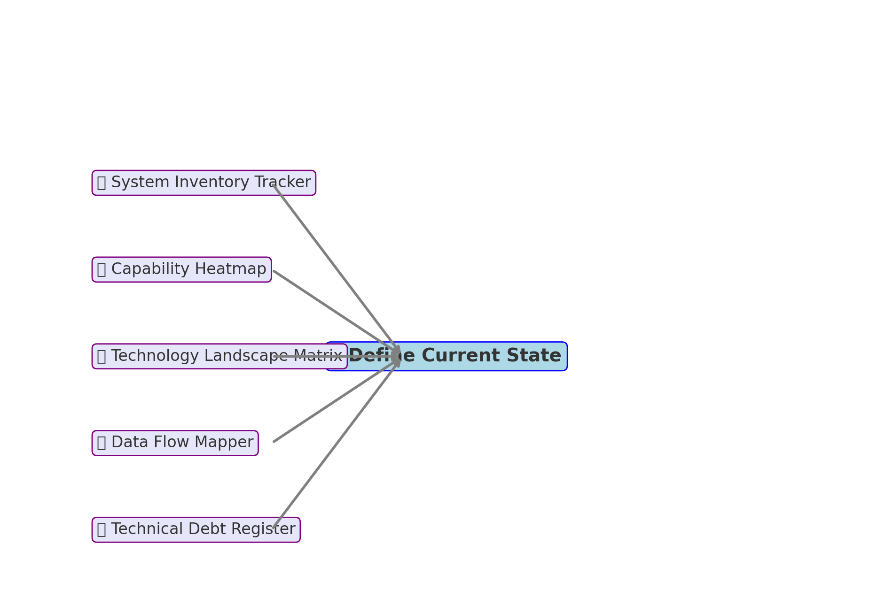

# 📦 Enterprise Data Architecture Toolkit

This toolkit includes five offline tools to support the "Define Current State" stage of enterprise architecture, aligned with the Pragmatic Architect roadmap.

---

## 🧭 Toolkit Diagram



---

## 📋 Included Tools

| Tool                        | Purpose                                      |
|----------------------------|----------------------------------------------|
| System Inventory Tracker   | Catalog current systems and their metadata   |
| Capability Heatmap         | Map capabilities to supporting systems       |
| Technology Landscape Matrix| Assess platforms, versions, lifecycle status |
| Data Flow Mapper           | Document system-to-system data movement      |
| Technical Debt Register    | Log known technical risks and fixes          |

---

## ▶️ How to Launch

Run the master launcher:
```bash
streamlit run eda_master_dashboard.py
```

Or run an individual tool:
```bash
cd tools/<tool_name>
streamlit run app.py
```
Example:
```bash
cd tools/system_inventory_tracker
streamlit run app.py
```
